# Carparazzi MVP - Database Design
## ERD Diagram + PostgreSQL/H2 Compatible DDL

---

## 🎯 MVP 요구사항 정리

**핵심 플로우:**
1. 사용자가 블랙박스 영상 업로드
2. AI가 영상에서 사고/위법 케이스들 자동 감지
3. 각 케이스별로 증거영상 클립 추출
4. 사용자가 추출된 영상들을 다운로드

**데이터베이스 설계 원칙:**
- PostgreSQL과 H2 데이터베이스 모두 호환
- DDL에서 CHECK 제약조건 제거하여 호환성 확보
- 검증 로직은 Kotlin 애플리케이션 레이어에서 처리
- UUID 생성은 애플리케이션에서 담당

---

## 📊 Mermaid ERD Diagram

```mermaid
erDiagram
    USERS {
        uuid user_id PK
        varchar email
        varchar nickname
        timestamp created_at
        timestamp last_login_at
        varchar status
    }

    VIDEO_UPLOADS {
        uuid upload_id PK
        uuid user_id FK
        varchar original_filename
        varchar s3_key
        bigint file_size_bytes
        int duration_seconds
        varchar file_format
        varchar upload_status
        timestamp uploaded_at
        timestamp completed_at
    }

    ANALYSIS_JOBS {
        uuid job_id PK
        uuid upload_id FK
        varchar job_status
        timestamp started_at
        timestamp completed_at
        bigint processing_time_ms
        int total_segments
        int total_violations_detected
        text error_message
        jsonb processing_metadata
    }

    VIOLATION_EVENTS {
        uuid violation_id PK
        uuid job_id FK
        varchar violation_type
        decimal timestamp_seconds
        decimal confidence_score
        varchar severity_level
        text description
        jsonb detection_metadata
        timestamp detected_at
    }

    EVIDENCE_CLIPS {
        uuid clip_id PK
        uuid violation_id FK
        uuid job_id FK
        varchar s3_key
        decimal start_time_seconds
        decimal end_time_seconds
        decimal duration_seconds
        bigint file_size_bytes
        varchar clip_status
        varchar download_url
        timestamp created_at
        timestamp expires_at
    }

    DOWNLOAD_LOGS {
        uuid download_id PK
        uuid user_id FK
        uuid clip_id FK
        varchar download_type
        timestamp downloaded_at
        varchar user_agent
        varchar ip_address
    }

    USERS ||--o{ VIDEO_UPLOADS : uploads
    VIDEO_UPLOADS ||--|| ANALYSIS_JOBS : analyzes
    ANALYSIS_JOBS ||--o{ VIOLATION_EVENTS : detects
    VIOLATION_EVENTS ||--|| EVIDENCE_CLIPS : generates
    USERS ||--o{ DOWNLOAD_LOGS : downloads
    EVIDENCE_CLIPS ||--o{ DOWNLOAD_LOGS : tracks
```



---

## 🗃️ PostgreSQL/H2 Compatible DDL

### 1. Users Table (사용자 관리)
```sql
-- 사용자 테이블
CREATE TABLE users (
    user_id UUID PRIMARY KEY,
    email VARCHAR(255) UNIQUE NOT NULL,
    nickname VARCHAR(100),
    created_at TIMESTAMP WITH TIME ZONE DEFAULT NOW(),
    last_login_at TIMESTAMP WITH TIME ZONE,
    status VARCHAR(20) DEFAULT 'ACTIVE'
);

-- 이메일 인덱스 (로그인용)
CREATE INDEX idx_users_email ON users(email);
CREATE INDEX idx_users_status ON users(status);
```

**애플리케이션 레이어 검증:**
- 이메일 형식: 정규식 `^[A-Za-z0-9._%+-]+@[A-Za-z0-9.-]+\.[A-Za-z]{2,}$`
- 사용자 상태: `ACTIVE`, `INACTIVE`, `SUSPENDED`
- 닉네임: 최대 100자, 공백 불허

### 2. Video Uploads Table (영상 업로드 관리)
```sql
-- 영상 업로드 테이블
CREATE TABLE video_uploads (
    upload_id UUID PRIMARY KEY,
    user_id UUID NOT NULL,
    original_filename VARCHAR(255) NOT NULL,
    s3_key VARCHAR(500) NOT NULL, -- S3 객체 키
    file_size_bytes BIGINT NOT NULL,
    duration_seconds INTEGER,
    file_format VARCHAR(10) NOT NULL,
    upload_status VARCHAR(20) DEFAULT 'UPLOADING',
    uploaded_at TIMESTAMP WITH TIME ZONE DEFAULT NOW(),
    completed_at TIMESTAMP WITH TIME ZONE,

    -- 외래키
    FOREIGN KEY (user_id) REFERENCES users(user_id) ON DELETE CASCADE
);

-- 인덱스
CREATE INDEX idx_video_uploads_user_id ON video_uploads(user_id);
CREATE INDEX idx_video_uploads_status ON video_uploads(upload_status);
CREATE INDEX idx_video_uploads_uploaded_at ON video_uploads(uploaded_at DESC);
CREATE UNIQUE INDEX idx_video_uploads_s3_key ON video_uploads(s3_key);
```

**애플리케이션 레이어 검증:**
- 파일 크기: 0보다 크고 5GB 이하
- 영상 길이: 0보다 크고 4시간 이하
- 파일 형식: `MP4`, `AVI`, `MOV`
- 업로드 상태: `UPLOADING`, `COMPLETED`, `FAILED`

### 3. Analysis Jobs Table (분석 작업 관리)
```sql
-- 분석 작업 테이블
CREATE TABLE analysis_jobs (
    job_id UUID PRIMARY KEY,
    upload_id UUID NOT NULL,
    job_status VARCHAR(20) DEFAULT 'QUEUED',
    started_at TIMESTAMP WITH TIME ZONE,
    completed_at TIMESTAMP WITH TIME ZONE,
    processing_time_ms BIGINT,
    total_segments INTEGER DEFAULT 0,
    total_violations_detected INTEGER DEFAULT 0,
    error_message TEXT,
    processing_metadata TEXT, -- JSON as TEXT for H2 compatibility

    -- 외래키
    FOREIGN KEY (upload_id) REFERENCES video_uploads(upload_id) ON DELETE CASCADE
);

-- 인덱스
CREATE INDEX idx_analysis_jobs_upload_id ON analysis_jobs(upload_id);
CREATE INDEX idx_analysis_jobs_status ON analysis_jobs(job_status);
CREATE INDEX idx_analysis_jobs_started_at ON analysis_jobs(started_at DESC);

-- 업로드당 하나의 분석 작업만 허용
CREATE UNIQUE INDEX idx_analysis_jobs_upload_unique ON analysis_jobs(upload_id);
```

**애플리케이션 레이어 검증:**
- 작업 상태: `QUEUED`, `PROCESSING`, `COMPLETED`, `FAILED`
- 처리 시간: 0 이상
- 총 세그먼트 수: 0 이상
- 총 위반 감지 수: 0 이상

### 4. Violation Events Table (위반 이벤트)
```sql
-- 위반 이벤트 테이블
CREATE TABLE violation_events (
    violation_id UUID PRIMARY KEY,
    job_id UUID NOT NULL,
    violation_type VARCHAR(30) NOT NULL,
    timestamp_seconds DECIMAL(10, 3) NOT NULL, -- 영상에서의 시점 (초.밀리초)
    confidence_score DECIMAL(5, 4) NOT NULL, -- 신뢰도 (0.0000 ~ 1.0000)
    severity_level VARCHAR(10) DEFAULT 'MEDIUM',
    description TEXT NOT NULL, -- "적색 신호에서 직진 감지" 등
    detection_metadata TEXT, -- JSON as TEXT for H2 compatibility
    detected_at TIMESTAMP WITH TIME ZONE DEFAULT NOW(),

    -- 외래키
    FOREIGN KEY (job_id) REFERENCES analysis_jobs(job_id) ON DELETE CASCADE
);

-- 인덱스
CREATE INDEX idx_violation_events_job_id ON violation_events(job_id);
CREATE INDEX idx_violation_events_type ON violation_events(violation_type);
CREATE INDEX idx_violation_events_timestamp ON violation_events(timestamp_seconds);
CREATE INDEX idx_violation_events_confidence ON violation_events(confidence_score DESC);
CREATE INDEX idx_violation_events_severity ON violation_events(severity_level);
```

**애플리케이션 레이어 검증:**
- 위반 유형: `SIGNAL_VIOLATION`, `LANE_VIOLATION`, `COLLISION`, `SUDDEN_BRAKING`, `SUDDEN_ACCELERATION`, `SPEEDING`, `ILLEGAL_TURN`, `ROAD_RAGE`
- 타임스탬프: 0 이상
- 신뢰도 점수: 0.0000 ~ 1.0000
- 심각도 레벨: `LOW`, `MEDIUM`, `HIGH`, `CRITICAL`

### 5. Evidence Clips Table (증거 영상 클립)
```sql
-- 증거 영상 클립 테이블
CREATE TABLE evidence_clips (
    clip_id UUID PRIMARY KEY,
    violation_id UUID NOT NULL,
    job_id UUID NOT NULL, -- 빠른 조회를 위한 중복 컬럼
    s3_key VARCHAR(500) NOT NULL, -- 트리밍된 영상의 S3 키
    start_time_seconds DECIMAL(10, 3) NOT NULL,
    end_time_seconds DECIMAL(10, 3) NOT NULL,
    duration_seconds DECIMAL(10, 3), -- Computed in application layer
    file_size_bytes BIGINT,
    clip_status VARCHAR(20) DEFAULT 'PROCESSING',
    download_url VARCHAR(1000), -- Pre-signed URL (임시)
    created_at TIMESTAMP WITH TIME ZONE DEFAULT NOW(),
    expires_at TIMESTAMP WITH TIME ZONE, -- Set in application layer

    -- 외래키
    FOREIGN KEY (violation_id) REFERENCES violation_events(violation_id) ON DELETE CASCADE,
    FOREIGN KEY (job_id) REFERENCES analysis_jobs(job_id) ON DELETE CASCADE
);

-- 인덱스
CREATE INDEX idx_evidence_clips_violation_id ON evidence_clips(violation_id);
CREATE INDEX idx_evidence_clips_job_id ON evidence_clips(job_id);
CREATE INDEX idx_evidence_clips_status ON evidence_clips(clip_status);
CREATE INDEX idx_evidence_clips_expires_at ON evidence_clips(expires_at);
CREATE UNIQUE INDEX idx_evidence_clips_s3_key ON evidence_clips(s3_key);

-- 위반 이벤트당 하나의 클립만 허용
CREATE UNIQUE INDEX idx_evidence_clips_violation_unique ON evidence_clips(violation_id);
```

**애플리케이션 레이어 검증:**
- 시작 시간: 0 이상
- 종료 시간: 시작 시간보다 큰 값
- 지속 시간: 종료 시간 - 시작 시간 (자동 계산)
- 파일 크기: 0보다 큰 값
- 클립 상태: `PROCESSING`, `READY`, `FAILED`, `EXPIRED`
- 만료 시간: 생성일로부터 7일 후 (자동 설정)

### 6. Download Logs Table (다운로드 추적)
```sql
-- 다운로드 로그 테이블 (사용량 분석용)
CREATE TABLE download_logs (
    download_id UUID PRIMARY KEY,
    user_id UUID NOT NULL,
    clip_id UUID,
    download_type VARCHAR(20) DEFAULT 'SINGLE',
    downloaded_at TIMESTAMP WITH TIME ZONE DEFAULT NOW(),
    user_agent TEXT,
    ip_address VARCHAR(45),

    -- 외래키
    FOREIGN KEY (user_id) REFERENCES users(user_id) ON DELETE CASCADE,
    FOREIGN KEY (clip_id) REFERENCES evidence_clips(clip_id) ON DELETE SET NULL
);

-- 인덱스
CREATE INDEX idx_download_logs_user_id ON download_logs(user_id);
CREATE INDEX idx_download_logs_clip_id ON download_logs(clip_id);
CREATE INDEX idx_download_logs_downloaded_at ON download_logs(downloaded_at DESC);
CREATE INDEX idx_download_logs_ip_address ON download_logs(ip_address);
```

**애플리케이션 레이어 검증:**
- 다운로드 유형: `SINGLE`, `BATCH`, `ZIP`
- IP 주소: IPv4/IPv6 형식 검증
- User Agent: 최대 1000자

---

## 🚀 추가 유틸리티

### 1. 자동 정리 함수 (만료된 파일 삭제)
```sql
-- 만료된 클립 정리 함수
CREATE OR REPLACE FUNCTION cleanup_expired_clips()
RETURNS INTEGER AS $
DECLARE
    deleted_count INTEGER;
BEGIN
    -- 만료된 클립들의 상태를 EXPIRED로 변경
    UPDATE evidence_clips
    SET clip_status = 'EXPIRED'
    WHERE expires_at < NOW()
    AND clip_status = 'READY';

    GET DIAGNOSTICS deleted_count = ROW_COUNT;

    RETURN deleted_count;
END;
$ LANGUAGE plpgsql;

-- 매일 자정에 실행되는 정리 작업 (cron job에서 호출)
-- SELECT cleanup_expired_clips();
```

### 2. 통계 조회 뷰
```sql
-- 사용자별 분석 통계 뷰
CREATE VIEW user_analysis_stats AS
SELECT
    u.user_id,
    u.email,
    u.nickname,
    COUNT(DISTINCT vu.upload_id) as total_uploads,
    COUNT(DISTINCT aj.job_id) as total_analyses,
    COUNT(DISTINCT ve.violation_id) as total_violations,
    COUNT(DISTINCT ec.clip_id) as total_clips,
    COUNT(DISTINCT dl.download_id) as total_downloads,
    MAX(vu.uploaded_at) as last_upload_at
FROM users u
LEFT JOIN video_uploads vu ON u.user_id = vu.user_id
LEFT JOIN analysis_jobs aj ON vu.upload_id = aj.upload_id
LEFT JOIN violation_events ve ON aj.job_id = ve.job_id
LEFT JOIN evidence_clips ec ON ve.violation_id = ec.violation_id
LEFT JOIN download_logs dl ON u.user_id = dl.user_id
GROUP BY u.user_id, u.email, u.nickname;

-- 위반 유형별 통계 뷰
CREATE VIEW violation_type_stats AS
SELECT
    violation_type,
    COUNT(*) as total_count,
    AVG(confidence_score) as avg_confidence,
    COUNT(CASE WHEN severity_level = 'CRITICAL' THEN 1 END) as critical_count,
    COUNT(CASE WHEN severity_level = 'HIGH' THEN 1 END) as high_count,
    COUNT(CASE WHEN severity_level = 'MEDIUM' THEN 1 END) as medium_count,
    COUNT(CASE WHEN severity_level = 'LOW' THEN 1 END) as low_count
FROM violation_events
GROUP BY violation_type
ORDER BY total_count DESC;
```

### 3. 성능 최적화 설정
```sql
-- 파티셔닝 (대용량 데이터 대비)
-- 월별로 파티셔닝 (필요시)
CREATE TABLE violation_events_y2025m01 PARTITION OF violation_events
FOR VALUES FROM ('2025-01-01') TO ('2025-02-01');

-- 인덱스 튜닝
-- 복합 인덱스들
CREATE INDEX idx_jobs_status_started ON analysis_jobs(job_status, started_at);
CREATE INDEX idx_clips_status_expires ON evidence_clips(clip_status, expires_at);

-- 부분 인덱스 (성능 향상)
CREATE INDEX idx_active_jobs ON analysis_jobs(started_at)
WHERE job_status IN ('QUEUED', 'PROCESSING');

CREATE INDEX idx_ready_clips ON evidence_clips(created_at)
WHERE clip_status = 'READY';
```

---

## 🔍 샘플 쿼리들

### 1. 사용자의 최근 분석 결과 조회
```sql
SELECT
    vu.original_filename,
    aj.job_status,
    aj.total_violations_detected,
    aj.processing_time_ms,
    aj.completed_at
FROM video_uploads vu
JOIN analysis_jobs aj ON vu.upload_id = aj.upload_id
WHERE vu.user_id = '550e8400-e29b-41d4-a716-446655440000'::UUID
ORDER BY vu.uploaded_at DESC
LIMIT 10;
```

### 2. 특정 분석의 모든 위반 및 클립 조회
```sql
SELECT
    ve.violation_type,
    ve.timestamp_seconds,
    ve.confidence_score,
    ve.description,
    ec.s3_key as clip_s3_key,
    ec.duration_seconds,
    ec.clip_status
FROM violation_events ve
LEFT JOIN evidence_clips ec ON ve.violation_id = ec.violation_id
WHERE ve.job_id = '550e8400-e29b-41d4-a716-446655440001'::UUID
ORDER BY ve.timestamp_seconds;
```

### 3. 다운로드 가능한 클립 목록
```sql
SELECT
    ec.clip_id,
    ve.violation_type,
    ve.description,
    ec.duration_seconds,
    ec.file_size_bytes,
    ec.download_url,
    ec.expires_at
FROM evidence_clips ec
JOIN violation_events ve ON ec.violation_id = ve.violation_id
JOIN analysis_jobs aj ON ec.job_id = aj.job_id
JOIN video_uploads vu ON aj.upload_id = vu.upload_id
WHERE vu.user_id = '550e8400-e29b-41d4-a716-446655440000'::UUID
AND ec.clip_status = 'READY'
AND ec.expires_at > NOW()
ORDER BY ec.created_at DESC;
```

---

## 📋 데이터 흐름 예시

### 1. 영상 업로드부터 다운로드까지
```sql
-- 1. 사용자 영상 업로드
INSERT INTO video_uploads (user_id, original_filename, s3_key, file_size_bytes, file_format)
VALUES ('550e8400-e29b-41d4-a716-446655440000'::UUID, 'blackbox_20250701.mp4', 'uploads/usr_12345/video_20250701.mp4', 1073741824, 'mp4');

-- 2. 분석 작업 시작
INSERT INTO analysis_jobs (upload_id, job_status, started_at)
VALUES ('550e8400-e29b-41d4-a716-446655440001'::UUID, 'PROCESSING', NOW());

-- 3. 위반 이벤트 감지
INSERT INTO violation_events (job_id, violation_type, timestamp_seconds, confidence_score, description)
VALUES ('550e8400-e29b-41d4-a716-446655440002'::UUID, 'SIGNAL_VIOLATION', 185.423, 0.9234, '적색 신호에서 직진 감지');

-- 4. 증거 클립 생성
INSERT INTO evidence_clips (violation_id, job_id, s3_key, start_time_seconds, end_time_seconds, file_size_bytes)
VALUES ('550e8400-e29b-41d4-a716-446655440003'::UUID, '550e8400-e29b-41d4-a716-446655440002'::UUID, 'clips/job_12345/signal_violation_185.mp4', 175.423, 305.423, 52428800);

-- 5. 분석 완료
UPDATE analysis_jobs
SET job_status = 'COMPLETED', completed_at = NOW(), processing_time_ms = 456789, total_violations_detected = 1
WHERE job_id = '550e8400-e29b-41d4-a716-446655440002'::UUID;

-- 6. 사용자 다운로드
INSERT INTO download_logs (user_id, clip_id, download_type, user_agent, ip_address)
VALUES ('550e8400-e29b-41d4-a716-446655440000'::UUID, '550e8400-e29b-41d4-a716-446655440004'::UUID, 'SINGLE', 'Mozilla/5.0...', '192.168.1.100');
```
